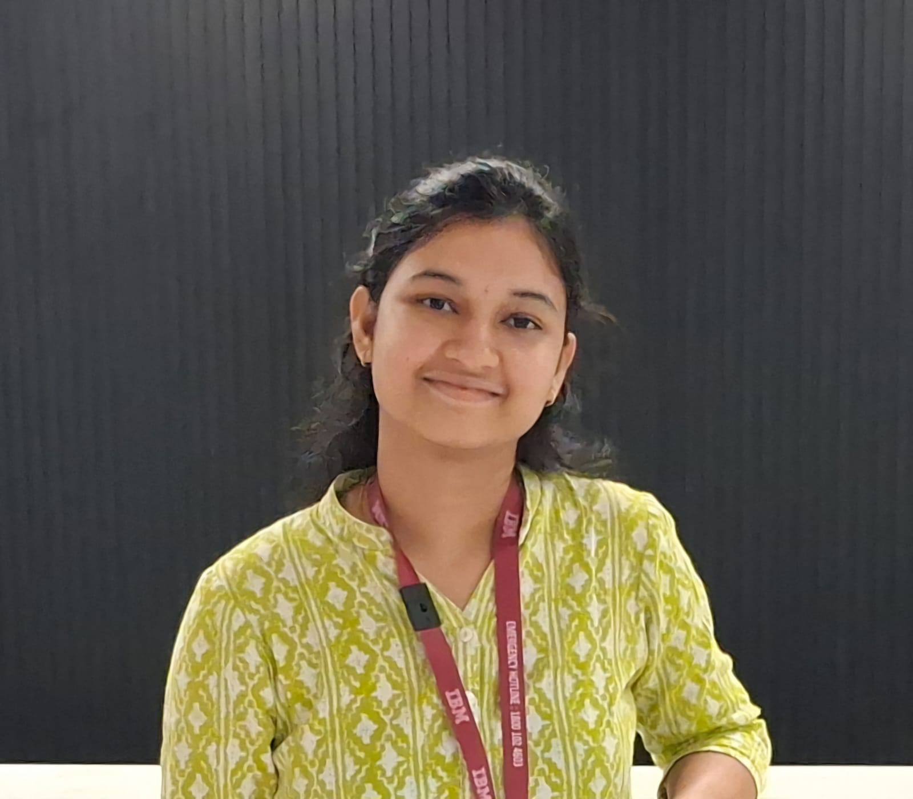

## Hi there! 👋

I am a second-year Masters by Research student at the [Centre for Machine Intelligence and Data Science](https://www.minds.iitb.ac.in/), IIT Bombay, under the guidance of [Prof. Preethi Jyothi](https://www.cse.iitb.ac.in/~pjyothi/). My research primarily focuses on Natural Language Processing (NLP), with a specialization in **Cross-Lingual Transfer**. I obtained my B.Tech in Electrical Engineering from Indian Institute of Technology Tirupati.

I am currently working on **Parameter-Efficient Fine-Tuning (PEFT)** methods for cross-lingual transfer. Exploring ways to enhance multilingual model performance across diverse languages, including Indian languages as well as other major global low resource languages for challenging reasoning and generation tasks.

Previously, I interned at **IBM Research**, where I worked on **Continual Learning** for NLP, exploring ways to make language models adapt to new tasks without forgetting previously learnt tasks. My work received the **Best Paper Award at the internal IBM IRIS Symposium**.

Beyond my research, I actively contribute to open-source communities and was a participant in the Aya Expedition, where our team received the **Promising Research Project Award**. As a student from Tamil Nadu, I have also contributed to the creation of Tamil datasets for two NLP tasks.

